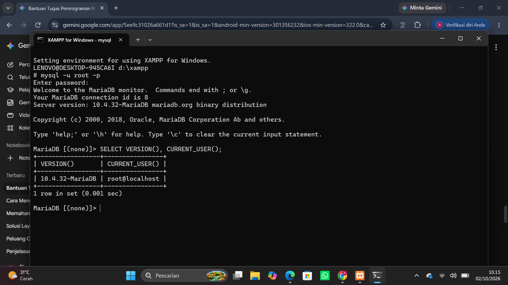
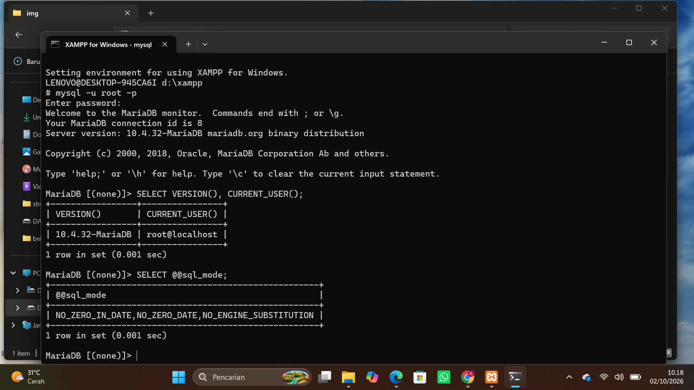
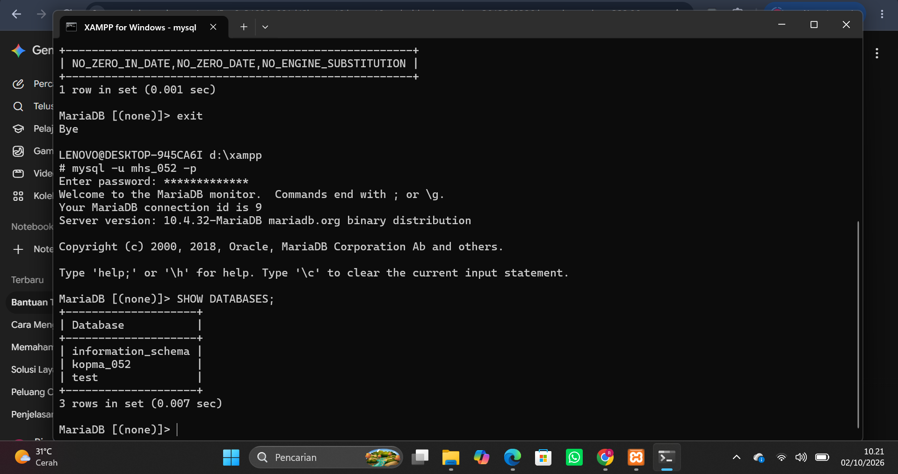
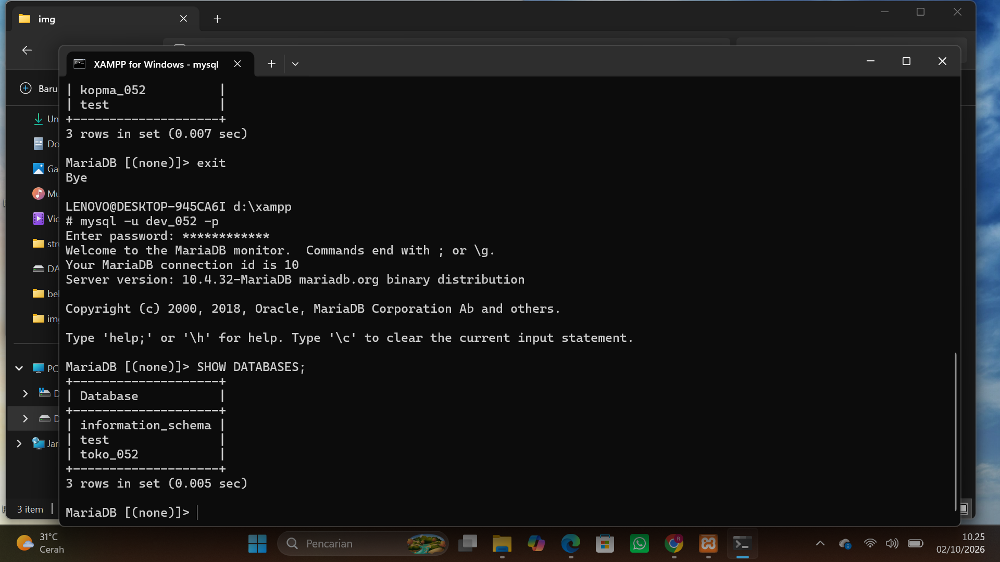
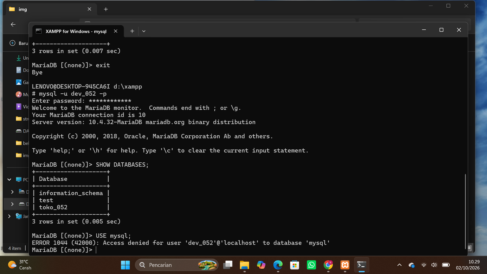
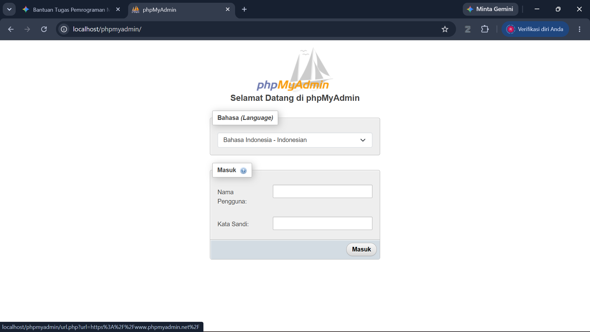
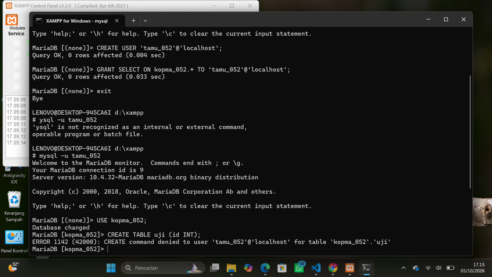
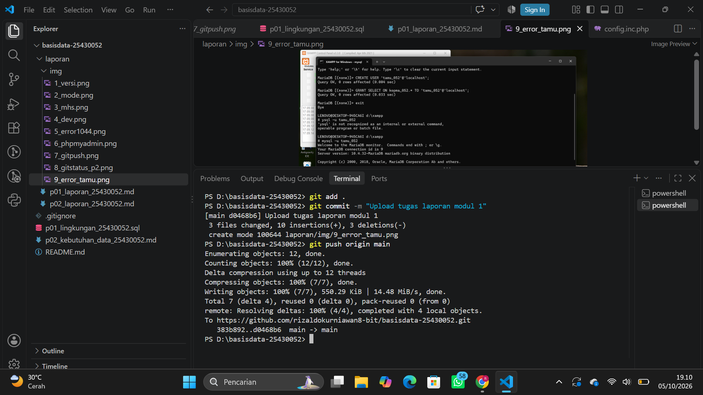

# Laporan Praktikum Basis Data - Pertemuan 01
**Nama:** Rizaldo Kurniawan **NIM:** 25430052 **Kelas:** B **Tanggal:** 01 Oktober 2026

## 1. Tujuan Praktikum
1. Nyoba langsung masuk ke server MariaDB pakai CMD (Command Prompt) layar hitam, bukan yang tinggal klik-klik.
2. Latihan bikin akun user baru di database terus ngatur hak aksesnya (biar tahu bedanya akun admin dan akun biasa).
3. Nyiapin database kosong khusus buat ngerjain tugas akhir proyek Toko Pakaian RK Apparel nanti.

## 2. Ringkasan Dasar Teori
Jujur, dari modul 1 ini intinya kita diajarin cara ngendaliin database cuma lewat ketikan teks di CMD. Pelajaran paling pentingnya itu soal hak akses (privilege). Gunanya biar sistem lebih aman. Jadi tiap akun tuh dibatasi, cuma bisa buka atau ngedit database jatahnya sendiri. Kalau nggak ada hak akses, orang bisa asal masuk dan ngacak-acak data punya orang lain.

## 3. Hasil Langkah Percobaan
(Tangkapan Layar Versi dan User)

(Tangkapan Layar SQL Mode)

(Tangkapan Layar Hak Akses mhs_052)

(Tangkapan Layar Hak Akses dev_052)

(Tangkapan Layar Error 1044)

(Tangkapan Layar phpMyAdmin Mode Cookie)

## 4. Jawaban Titik Analisis
* **Titik Analisis 1:** Meskipun tombol di XAMPP tulisannya 'MySQL', server yang jalan sebenarnya itu MariaDB. Konsekuensinya pas kita nyari solusi error di internet, kita harus lebih teliti. Dokumentasi MySQL masih bisa dipakai buat perintah SQL dasar kayak SELECT atau INSERT, tapi kalau error-nya udah soal fitur spesifik, kita wajib nyari referensinya ke dokumentasi resmi MariaDB biar dapet solusi yang bener.
* **Titik Analisis 2:** Waktu saya coba login pakai perintah mysql -u root tanpa tambahan opsi -p, langsung muncul pesan ERROR 1045 ... (using password: NO). Nah, keterangan (using password: NO) di akhir pesan itu yang jadi petunjuk utama kalau CMD sama sekali nggak ngirim password ke server waktu nyoba masuk.
* **Titik Analisis 3:** Database information_schema isinya cuma metadata (informasi soal tabel dan kolom), bukan data penting, makanya akun mhs_052 tetap bisa lihat karena diizinkan otomatis sama sistem. Beda sama database mysql yang langsung ditolak dan ngeluarin ERROR 1044. Itu karena database mysql nyimpen data sensitif kayak daftar akun dan password server, sedangkan hak akses akun mhs_052 emang sengaja saya batasi cuma bisa buka database kopma_052 aja.
* **Titik Analisis 4:** Mode cookie jelas lebih aman, soalnya kita dipaksa buat masukin password tiap kali mau login ke halaman phpMyAdmin. Kalau pakai mode config, password root-nya bakal ketulis mentah-mentah di dalam file config.inc.php. Nanti kalau filenya nggak sengaja bocor, orang lain bisa langsung masuk dengan akses tertinggi ke database kita.   
* **Error 1044:** Awalnya saya cuma ngikutin dan salin kode dari modul buat login pakai akun dev_052, terus disuruh ngetik `USE mysql;`. Eh malah muncul error ini. Setelah saya baca-baca lagi, ternyata ini gara-gara akun dev_052 emang sengaja dibatasi haknya, jadi dia nggak punya izin buat masuk dan ngebuka database bawaan sistem (mysql).
* **Error 1045:** Nah, ini error yang bikin saya nyangkut lumayan lama pas praktikum tadi. Waktu mau masuk CMD pakai akun dev_052, gagal masuk terus padahal saya ngerasa password-nya udah bener. Ternyata masalahnya antara saya yang typo pas ngetik password di layar hitam, atau emang ada sisa data user lama yang nyangkut di laptop. Intinya ini error karena murni gagal login di pintu depan.
* **Error 1142:** Kalau error ini beda lagi. Posisinya saya udah sukses masuk ke database, tapi pas saya iseng nyoba jalanin perintah (misalnya mau hapus data pakai perintah DROP), malah diblokir sama sistem. Rupanya karena hak akses akun yang saya pakai dibatasi, misal cuma dikasih izin buat ngelihat data, tapi malah maksa ngasih perintah buat ngehapus.

## 5. Hasil Latihan dan Modifikasi
(Membuat Akun Tamu dan Uji Hak Akses)

Muncul pesan `ERROR 1142 (42000): CREATE command denied`. Maknanya adalah server MariaDB menolak perintah pembuatan tabel karena akun `tamu_052` tidak memiliki hak akses (privilege) untuk melakukan `CREATE`.

(Menambahkan IF NOT EXISTS)
Telah ditambahkan pada file skrip `p01_lingkungan_25430052.sql`.

## 6. Tugas Mandiri: Milestone Proyek 01
Milestone untuk proyek mandiri telah diselesaikan. Basis data `toko_052` dan akun pengembang `dev_052` untuk proyek Toko Pakaian RK Apparel sudah berhasil dibuat dan diuji hak aksesnya, sebagaimana dibuktikan pada file SQL dan tangkapan layar di atas.

## 7. Pembahasan dan Kendala
Kendala paling bikin pusing pas praktikum ini ya pas kena Error 1045 itu. Saya sempet bingung kok gagal login pakai akun dev_052 padahal ngerasa password udah bener. Setelah cari tahu, ternyata ada sisa akun lama yang nyangkut. Akhirnya saya login lagi pakai akun tertinggi (root), hapus user lama yang error itu, baru nge-run ulang file SQL-nya dari awal. Sama tadi sempet bingung dikit cara ngatur letak folder screenshot di VS Code biar gambarnya bisa muncul di laporan Markdown.

## 8. Kesimpulan
Akhirnya dari praktikum pertama ini, database buat proyek RK Apparel udah berhasil disiapin. Saya juga jadi lumayan paham cara kerja hak akses setelah ngelewatin banyak error tadi. Terbukti sekarang akun mhs_052 sama dev_052 udah punya batasan masing-masing dan nggak bisa saling ganggu data satu sama lain.

## 9. Pernyataan Penggunaan AI
Jujur dalam pengerjaan modul ini saya pakai bantuan Gemini. Saya pakai Gemini buat nyari referensi kode SQL, nanya maksud dari error yang muncul, sama merapikan format tulisan laporan Markdown. Tapi kodenya nggak asal saya copy-paste mentah-mentah, tetep saya analisa dan pahamin dulu maksud per barisnya sebelum saya ketik dan tes sendiri di CMD.

## 10. Bukti Git
(Bukti Git Push)

Tautan Repositori GitHub: https://github.com/rizaldokurniawan8-bit/basisdata-25430052
Hash Commit: [Copy dan paste kode hash dari commit p01 lu di sini]

## Checklist
- [x] p01_lingkungan_25430052.sql (dapat dijalankan ulang), README.md berisi Identitas Proyek, .gitignore
- [x] SELECT VERSION(), CURRENT_USER(); SELECT @@sql_mode; SHOW DATABASES sebagai mhs_052 dan dev_052; galat 1044 dan 1142; halaman masuk phpMyAdmin mode cookie; git push pertama
- [x] Titik Analisis 1-4; perbedaan kode galat 1044, 1045, dan 1142