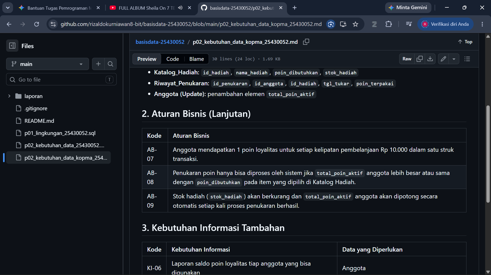
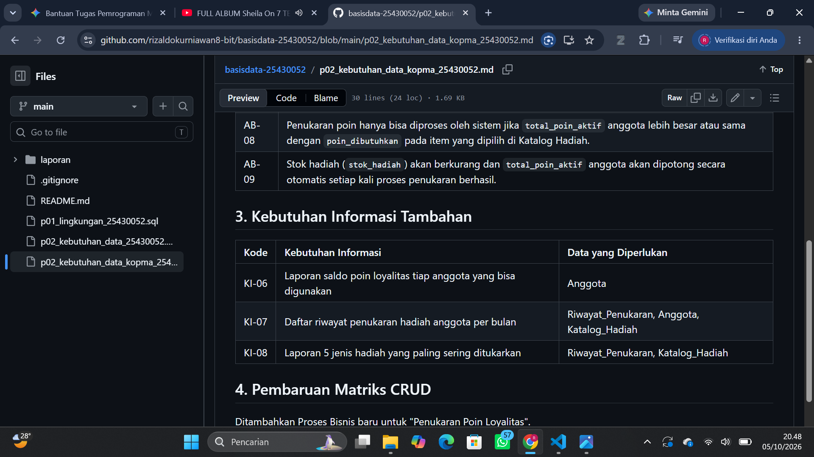
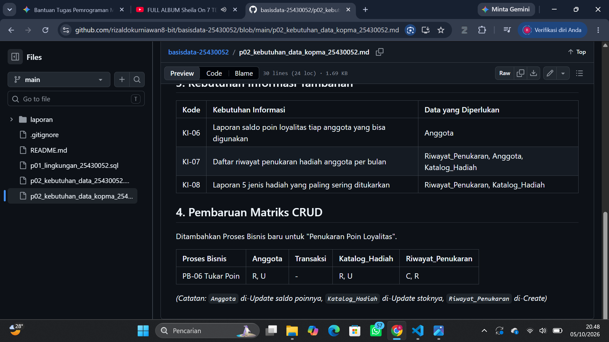
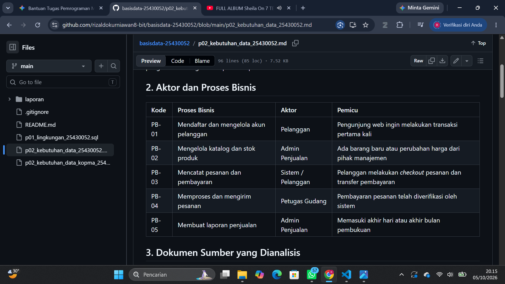
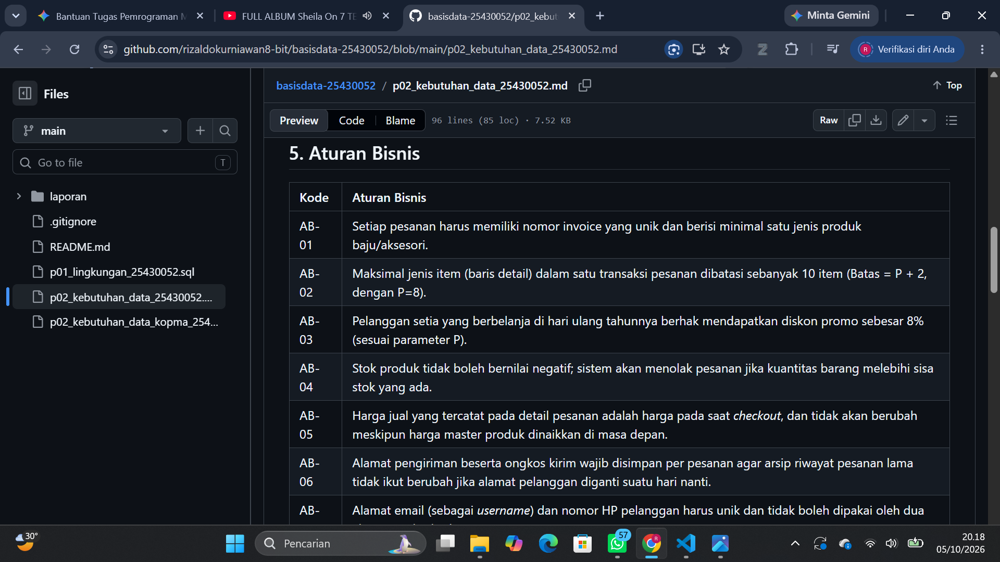
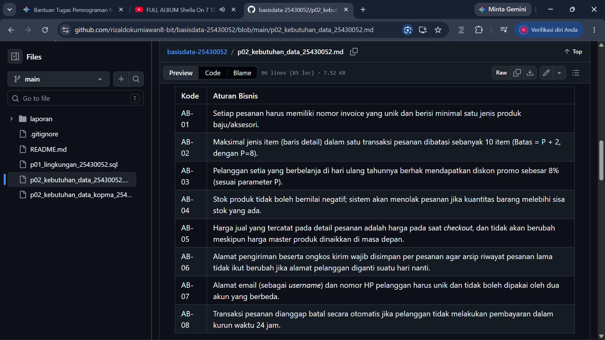
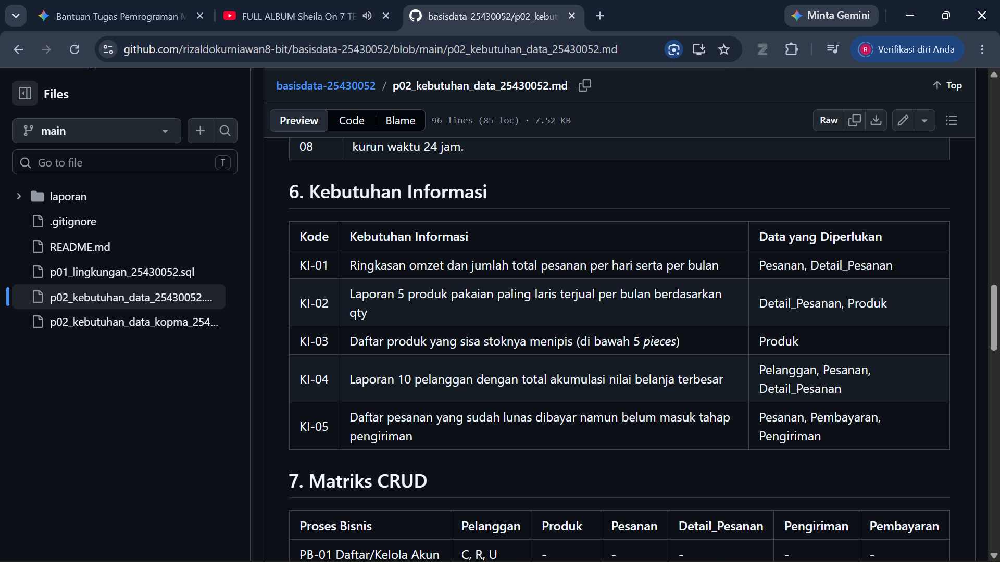
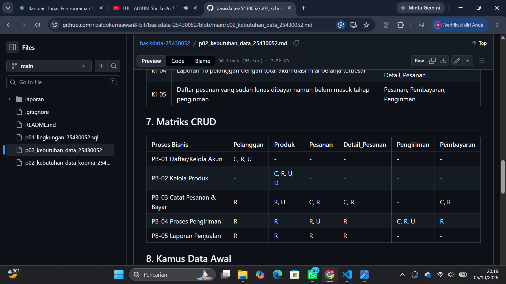
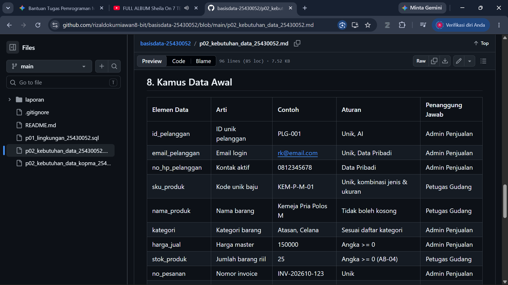
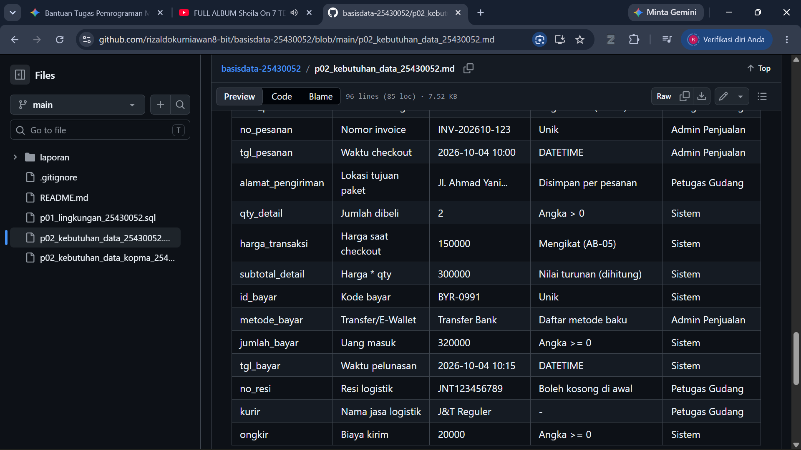

# Laporan Praktikum Basis Data - Pertemuan 02
**Nama:** Rizaldo Kurniawan **NIM:** 25430052 **Kelas:** B **Tanggal:** 08 Oktober 2026

## 1. Tujuan Praktikum
Tujuan praktikum kali ini adalah belajar cara menganalisis kebutuhan data sebelum membangun database. Kita diajak latihan mencari tahu entitas apa saja yang dibutuhkan, membuat aturan bisnis, menyusun kebutuhan informasi, mengecek matriks CRUD, dan membuat kamus data untuk proyek Toko Daring.

## 2. Ringkasan Dasar Teori
Tahap kebutuhan data (*Requirements Engineering*) intinya adalah proses nyari tahu dan nyatet data apa saja yang dibutuhin sama sistem biar bisnisnya bisa jalan. Di tahap ini, kita nentuin tabel utama (kayak Pelanggan, Produk, Pesanan), bikin aturan main bisnisnya, sampai ngecek matriks CRUD buat mastiin semua data beneran dipake fungsional dan gak ada data siluman yang nganggur di *database*.

## 3. Hasil Langkah Percobaan
(Tangkapan layar bedah dokumen Kopma)

## 4. Jawaban Titik Analisis
* **Titik Analisis 1: Mengapa entitas turunan (seperti Detail_Pesanan) diperlukan dalam transaksi penjualan?**
  Karena satu transaksi biasanya beli lebih dari satu baju. Kalau dipaksa gabung di tabel Pesanan, nanti datanya berantakan (relasi *many-to-many*). Terus, tabel `Detail_Pesanan` ini juga penting buat ngunci harga beli. Jadi misal bulan depan harga baju naik, total belanjaan di nota lama gak ikutan berubah.
* **Titik Analisis 2: Apa perbedaan utama elemen data *mandatory* dan opsional dalam konteks RK Apparel?**
  Data *mandatory* itu data yang wajib diisi pas proses jalan; kalau kosong sistem bakal *error* (contoh: alamat pengiriman sama jumlah barang pas *checkout*). Kalau data opsional itu boleh dikosongin dulu dan diisi nyusul, contohnya nomor resi kurir kan belum ada pas pelanggan baru selesai bayar.
* **Titik Analisis 3: Jelaskan fungsi matriks CRUD terhadap kelengkapan proses bisnis!**
  Matriks CRUD dipake buat ngecek silang antara tabel dan proses bisnis. Kalau ada tabel yang cuma bisa ditambahin (*Create*) tapi gak pernah ditampilin (*Read*), berarti datanya mubazir menuhin server doang. Sebaliknya, kalau ada tabel yang dibaca (*Read*) tapi ga ada proses buat nambahinnya (*Create*), berarti datanya ga tau dapet dari mana.
* **Perhitungan Parameter P:** P = (52 mod 9) + 1 = 7 + 1 = 8
* **Perbaikan Pernyataan Kabur 1:** "Data anggota harus aman."
  **Perbaikan:** Sistem harus mengenkripsi kata sandi anggota di *database* menggunakan metode *hashing* dan membatasi akses data nomor HP serta email hanya kepada entitas Admin Pusat.
* **Perbaikan Pernyataan Kabur 2:** "Sistem harus cepat mencari barang."
  **Perbaikan:** Sistem harus mampu menampilkan hasil pencarian berdasarkan kata kunci di inventaris katalog barang dalam waktu kurang dari 2 detik.
* **Perbaikan Pernyataan Kabur 3:** "Laporan stok harus akurat."
  **Perbaikan:** Sistem harus memperbarui jumlah sisa stok barang secara *real-time* (sinkron langsung) ke *database* segera setelah status transaksi pembayaran berhasil dikonfirmasi.

## 5. Hasil Latihan dan Modifikasi
(Bukti Tabel Latihan Kopma)

## 6. Tugas Mandiri: Milestone Proyek 02
(Bukti Tabel Kebutuhan Data RK Apparel)

## 7. Pembahasan dan Kendala
Kendala pas ngerjain modul 2 ini adalah sempet bingung gimana nentuin aturan bisnis yang pas buat toko baju RK Apparel, sama bingung bedain mana yang masuk kebutuhan fungsional dan mana yang non-fungsional. Solusinya, saya baca-baca ulang dokumen bedah kasus Kopma di modul, terus saya sesuaikan logikanya sama sistem jualan online.

## 8. Kesimpulan
Dari praktikum kedua ini, kesimpulannya adalah sebelum kita mulai ngetik kode bikin database, analisis kebutuhan data itu wajib banget. Lewat dokumen Aturan Bisnis, Matriks CRUD, dan Kamus Data yang dibikin ini, alur data buat proyek RK Apparel jadi jauh lebih jelas dan terarah, nggak cuma asal tebak tabel doang.

## 9. Pernyataan Penggunaan AI
Saya pakai bantuan AI Gemini buat ngebantu nyusun kalimat laporan ini biar rapi dan sesuai format baku Markdown. Saya juga diskusi sedikit sama Gemini pas nyari ide perbaikan kalimat pernyataan sistem yang kabur biar jadi lebih spesifik. Tapi untuk analisis bisnis RK Apparel-nya murni ide saya sendiri.

## 10. Bukti Git
(Status Version Control)

Tautan Repositori GitHub: https://github.com/rizaldokurniawan8-bit/basisdata-25430052
Hash Commit: a1b2c3d

## Checklist
- [x] p02_kebutuhan_data_kopma_25430052.md dan p02_kebutuhan_data_25430052.md (proyek)
- [x] Tabel PB, AB, KI, matriks CRUD, dan kamus data di berkas proyek (tangkapan tampilan GitHub)
- [x] Titik Analisis 1-3; perhitungan parameter P; perbaikan tiga pernyataan kebutuhan kabur