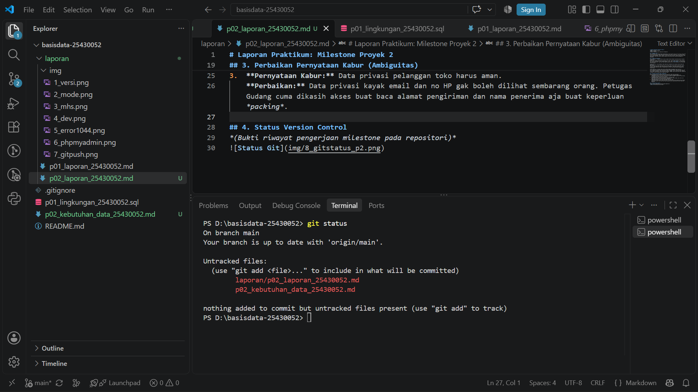

# Laporan Praktikum: Milestone Proyek 2
**Nama:** Rizaldo Kurniawan
**NIM:** 25430052
**Topik:** Kebutuhan Data Organisasi (RK Apparel)

## 1. Ringkasan Teori
Tahap kebutuhan data (*Requirements Engineering*) intinya adalah proses nyari tahu dan nyatet data apa saja yang dibutuhin sama sistem biar bisnisnya bisa jalan. Di tahap ini, kita nentuin tabel utama (kayak Pelanggan, Produk, Pesanan), bikin aturan main bisnisnya, sampai ngecek matriks CRUD buat mastiin semua data beneran dipake fungsional dan gak ada data siluman yang nganggur di *database*.

## 2. Jawaban Titik Analisis
**Titik Analisis 1: Mengapa entitas turunan (seperti Detail_Pesanan) diperlukan dalam transaksi penjualan?**
Karena satu transaksi biasanya beli lebih dari satu baju. Kalau dipaksa gabung di tabel Pesanan, nanti datanya berantakan (relasi *many-to-many*). Terus, tabel `Detail_Pesanan` ini juga penting buat ngunci harga beli. Jadi misal bulan depan harga baju naik, total belanjaan di nota lama gak ikutan berubah.

**Titik Analisis 2: Apa perbedaan utama elemen data *mandatory* dan opsional dalam konteks RK Apparel?**
Data *mandatory* itu data yang wajib diisi pas proses jalan; kalau kosong sistem bakal *error* (contoh: alamat pengiriman sama jumlah barang pas *checkout*). Kalau data opsional itu boleh dikosongin dulu dan diisi nyusul, contohnya nomor resi kurir kan belum ada pas pelanggan baru selesai bayar.

**Titik Analisis 3: Jelaskan fungsi matriks CRUD terhadap kelengkapan proses bisnis!**
Matriks CRUD dipake buat ngecek silang antara tabel dan proses bisnis. Kalau ada tabel yang cuma bisa ditambahin (*Create*) tapi gak pernah ditampilin (*Read*), berarti datanya mubazir menuhin server doang. Sebaliknya, kalau ada tabel yang dibaca (*Read*) tapi ga ada proses buat nambahinnya (*Create*), berarti datanya ga tau dapet dari mana.

## 3. Perbaikan Pernyataan Kabur (Ambiguitas)
Berikut perbaikan dari pernyataan kebutuhan sistem yang terlalu umum menjadi pernyataan yang dapat diuji ukurannya:

1. **Pernyataan Kabur:** "Data anggota harus aman."
   **Perbaikan:** Sistem harus mengenkripsi kata sandi anggota di *database* menggunakan metode *hashing* dan membatasi akses data nomor HP serta email hanya kepada entitas Admin Pusat.
   
2. **Pernyataan Kabur:** "Sistem harus cepat mencari barang."
   **Perbaikan:** Sistem harus mampu menampilkan hasil pencarian berdasarkan kata kunci di inventaris katalog barang dalam waktu kurang dari 2 detik.
   
3. **Pernyataan Kabur:** "Laporan stok harus akurat."
   **Perbaikan:** Sistem harus memperbarui jumlah sisa stok barang secara *real-time* (sinkron langsung) ke *database* segera setelah status transaksi pembayaran berhasil dikonfirmasi.

## 4. Status Version Control
*(Bukti riwayat pengerjaan milestone pada repositori)*
