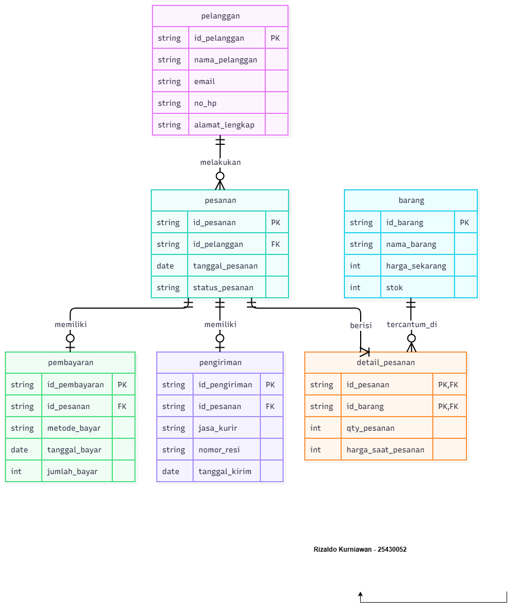

# Laporan Praktikum Basis Data - Pertemuan 3
**Nama:** Rizaldo Kurniawan    **NIM:** 25430052    **Kelas:** Ilmu Komputer (Semester 3)    **Tanggal:** [Isi Tanggal Praktikum P03]

## 1. Tujuan Praktikum
1. Mahasiswa memahami konsep dasar pemodelan data relasional.
2. Mahasiswa mampu merancang *Entity Relationship Diagram* (ERD) berdasarkan aturan bisnis (Business Rule) suatu sistem.
3. Mahasiswa mampu mendefinisikan entitas, atribut, relasi, beserta kardinalitas dan entitas asosiatif.

## 2. Ringkasan Dasar Teori
*Entity Relationship Diagram* (ERD) adalah bentuk pemodelan basis data konseptual yang menggambarkan hubungan antar penyimpan data. Komponen utama ERD terdiri dari:
*   **Entitas:** Objek yang datanya akan disimpan (contoh: Pelanggan, Barang).
*   **Atribut:** Karakteristik atau rincian dari sebuah entitas.
*   **Relasi:** Hubungan antar entitas, yang memiliki metrik berupa Kardinalitas (seperti *One-to-One*, *One-to-Many*, dan *Many-to-Many*). Pada relasi *Many-to-Many*, seringkali dibutuhkan entitas asosiatif sebagai tabel perantara.

## 3. Hasil Langkah Percobaan
*(Tuliskan secara singkat langkah-langkah percobaan membuat ERD Kopma di sini, atau hapus teks ini jika asisten dosen tidak memintanya)*

## 4. Jawaban Titik Analisis
*(Jawab pertanyaan analisis Modul 3 di sini jika ada)*

## 5. Hasil Latihan dan Modifikasi
**(Studi Kasus Kopma)**

**1. Penambahan Kebutuhan Poin Loyalitas**
Menurut saya, kita perlu menambahkan entitas baru bernama `riwayat_poin`. Alasannya karena poin ini punya nilai kayak uang (buat diskon). Kalau poinnya cuma ditaruh sebagai atribut `saldo_poin` di tabel `anggota`, kita bakal kesulitan melacak dari mana asal usul poin itu (kapan dapatnya dan kapan dipakainya). Dengan bikin entitas `riwayat_poin` yang nyambung ke `anggota` dan `penjualan`, kita bisa nyimpen riwayat keluar-masuk poinnya dengan jelas.

**2. Relasi Penjualan-Barang Tanpa Entitas Asosiatif**
Kalau tabel `penjualan` dan `barang` langsung dihubungkan (many-to-many) tanpa tabel perantara, bakal ada data penting yang hilang. Kita jadi nggak bisa nyimpen jumlah barang yang dibeli (`qty`) dan harga saat transaksi. Data ini nggak bisa ditaruh di tabel `penjualan` (soalnya satu nota bisa beli macam-macam barang), dan nggak bisa juga di tabel `barang` (soalnya harga barang bisa berubah-ubah, nanti malah merusak riwayat harga di nota lama).

## 6. Tugas Mandiri: Milestone Proyek 3
**(Toko Daring)**

**1. ERD Proyek Toko Daring**
*(Gambar p03_erd_25430052.png disisipkan di sini)*

**2. Tabel Relasi dan Kardinalitas**

| Relasi | Sisi Kiri (Maks) | Sisi Kanan (Maks) | Dasar Aturan Bisnis (AB) |
| :--- | :--- | :--- | :--- |
| pelanggan melakukan pesanan | tepat 1 pelanggan | 0 atau banyak pesanan | Pelanggan boleh bikin akun dulu walaupun belum mau pesan barang. |
| pesanan berisi detail_pesanan | tepat 1 pesanan | 1 atau banyak detail | Satu pesanan valid minimal harus ada satu barang di dalamnya. |
| barang tercantum di detail_pesanan | tepat 1 barang | 0 atau banyak detail | Bisa jadi ada barang di sistem yang belum pernah dibeli sama sekali. |
| pesanan memiliki pembayaran | tepat 1 pesanan | 0 atau 1 pembayaran | Pesanan bisa aja belum dibayar atau dibatalkan. |
| pesanan memiliki pengiriman | tepat 1 pesanan | 0 atau 1 pengiriman | Pengiriman cuma diproses kalau pesanannya udah dibayar lunas. |

**3. Tabel Penelusuran Kebutuhan Informasi (KI)**

| Kode KI | Kebutuhan Informasi | Jalur ERD yang Ditelusuri |
| :--- | :--- | :--- |
| KI-01 | Total omzet dan jumlah pesanan per bulan | pesanan, detail_pesanan |
| KI-02 | 5 barang terlaris berdasarkan qty terjual | barang -> detail_pesanan -> pesanan |
| KI-03 | Daftar pesanan pelanggan yang belum dibayar | pelanggan -> pesanan -> pembayaran |

**4. Entitas Asosiatif**
Di ERD proyek ini, saya pakai entitas asosiatif bernama `detail_pesanan`. Tabel ini fungsinya buat ngehubungin tabel `pesanan` sama `barang`. Atribut yang ada di dalamnya yaitu `id_pesanan`, `id_barang`, `qty_pesanan`, dan `harga_saat_pesanan`. Harga ini penting ditaruh di sini biar kalau harga master barang naik, harga di nota pesanan lama nggak ikut berubah.

**5. Catatan Tinjauan Klien**
*   **Masukan 1:** Klien (teman) nanya gimana cara kita ngecek paket dikirim pakai kurir apa.
    *   **Keputusan:** Saya terima masukannya. Jadi saya tambahin atribut `jasa_kurir` dan `nomor_resi` di tabel `pengiriman`.
*   **Masukan 2:** Ada saran buat bikin tabel khusus untuk "Keranjang Belanja".
    *   **Keputusan:** Saya tolak, karena menurut saya keranjang belanja itu datanya masih sementara pas user milih-milih barang. Kalau udah di-*checkout*, datanya otomatis langsung masuk ke tabel `pesanan` dan `detail_pesanan`.

## 7. Pembahasan dan Kendala
**Pembahasan:** 
Melalui perancangan ERD ini, saya memahami pentingnya entitas asosiatif dalam mengatasi relasi *many-to-many* antara entitas `pesanan` dan `barang`. 

**Kendala:**
Sempat bingung dalam menentukan batas atribut antara entitas keranjang belanja dan pesanan, namun sudah diselesaikan melalui *review* dengan klien.

## 8. Kesimpulan
Pemodelan ERD sangat penting dilakukan sebelum membangun basis data secara fisik. Penentuan relasi dan kardinalitas yang tepat akan mencegah kehilangan data bersejarah (seperti harga barang saat dibeli) dan menghindari kebingungan struktur di masa depan.

## 9. Pernyataan Penggunaan AI
- [ ] Saya tidak menggunakan AI dalam mengerjakan tugas ini.
- [x] Saya menggunakan AI (Gemini) sebagai mitra diskusi untuk membantu menganalisis ERD, merumuskan dasar aturan bisnis (*Business Rules*), serta merapikan format laporan Markdown. Seluruh gagasan dan hasil dari AI tersebut telah saya pelajari, validasi, dan sesuaikan kembali dengan logika kebutuhan proyek Toko Daring.

## 10. Bukti Git
**Tautan Repositori:** `https://github.com/rizaldokurniawan8-bit/basisdata-25430052`
**Hash Commit:** `[ISI_DENGAN_HASH_COMMIT]`

---

## Checklist
- [x] Laporan menggunakan format Markdown `.md`
- [x] Nama file sesuai ketentuan
- [x] Semua gambar disimpan di dalam folder `laporan/img/`
- [x] Telah mengerjakan Bagian Tugas Mandiri (Milestone Proyek)
- [x] Telah melakukan `git add`, `git commit`, dan `git push` ke GitHub